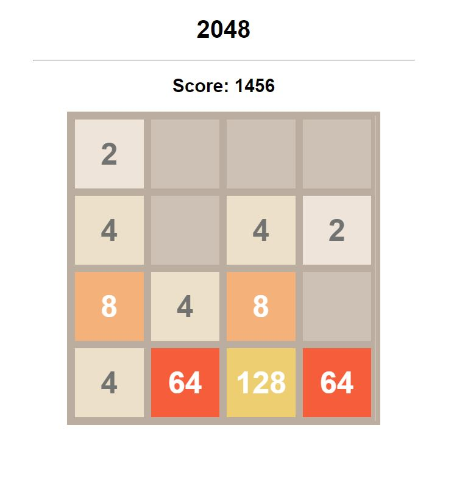

## 2048: A Challenging Number Puzzle Game

- This JavaScript code brings the addictive 2048 game to life in your web browser! Test your skills by strategically merging numbered tiles to reach the coveted 2048 tile.

### Gameplay:

- Use the arrow keys (left, right, up, down) to slide tiles in the chosen direction.
- Tiles with the same number that collide during a slide merge into a single tile with the sum of their values.
- New tiles with a value of 2 are randomly added to the board after each slide, keeping the game dynamic.
- The goal is to reach the tile labeled "2048" before the board fills up with no more possible merges.

### Features:

- Dynamic Tile Generation: New tiles with a value of 2 are randomly placed on the board after each move.
- Smooth Tile Merging: Tiles slide and merge seamlessly, providing a visually satisfying experience.
- Score Tracking: The game keeps track of your current score, motivating you to strive for higher achievements.
- Clean and Responsive Design: The game utilizes CSS for a clean and responsive layout that adapts to different screen sizes.
- Optional Customization: Consider adding features like a game over message or a win notification.

### Code Breakdown

1. HTML (2048.html):

- Defines the basic structure of the game screen, including a title (<h1>2048</h1>), score display (<h2>Score: 0</h2>), and a container (div) with the ID "board" to hold the game tiles.

2. JavaScript (2048.js):

- window.onload: Initializes the game when the web page loads.
- Sets the board dimensions (number of rows and columns).
- Calls functions to set up the game board, create tiles, and add event listeners for keyboard presses (arrow keys).

### setGame:

- Initializes the game board as a two-dimensional array with zeros representing empty tiles.
- Creates and populates the visual board by iterating through rows and columns, dynamically creating tiles using DOM manipulation.
- Calls the setTwo function twice to place two initial tiles with a value of 2 on the board.
- updateTile:
- Updates the visual appearance of a tile based on its numerical value.
- Clears the tile's previous content and class names.
- Assigns a class name based on the tile's value (e.g., "x2" for 2, "x4096" for 4096) for color coding.
- Sets the tile's inner text to display the numerical value.
- Event Listener (document.addEventListener('keyup')):
- Listens for arrow key presses (left, right, up, down).
- Based on the pressed key, calls the appropriate slide function (e.g., slideLeft for left arrow) to move and merge tiles in that direction.
- After each slide, calls the setTwo function to potentially add a new tile with a value of 2.
- Updates the score display with the current score.

#### filterZero:

- Creates a new array containing only non-zero elements from a given array (used for processing tile movements).

#### slide:

- Takes an array of tile values (representing a row or column) as input.
- Filters out zero elements, keeping only non-zero tiles together.
- Iterates through adjacent tiles:
- If two adjacent tiles have the same value, merges them into a single tile with the sum of their values and adds that value to the score.
- Shifts remaining tiles to the left to fill any empty spaces created by merging.
- Pads the end of the array with zeros if necessary to maintain the original size.
- Returns the modified array containing the merged and rearranged tiles.
  \*\*slideLeft, `slide

